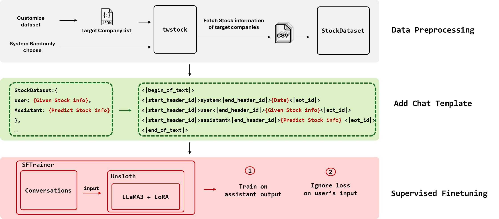
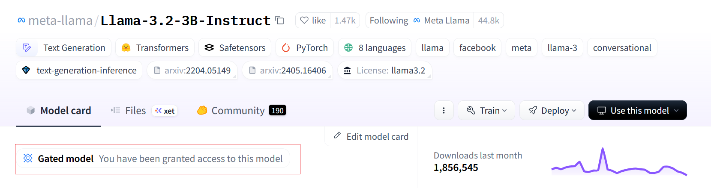
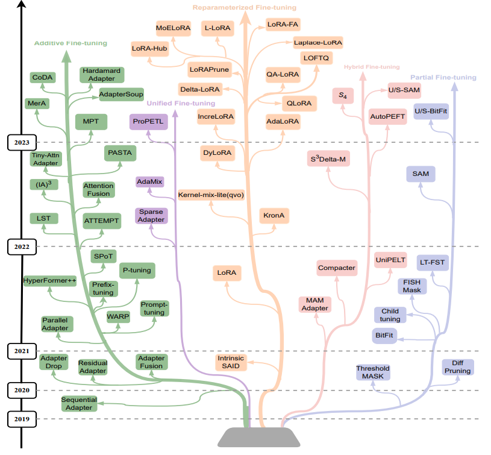
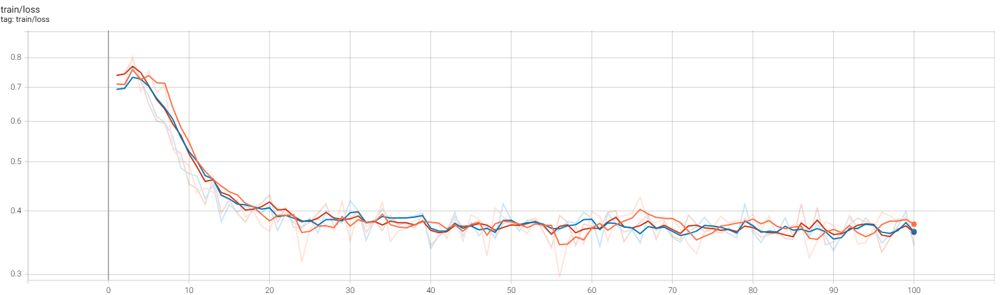
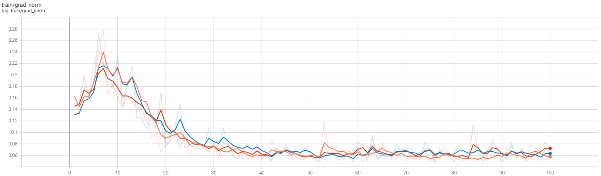
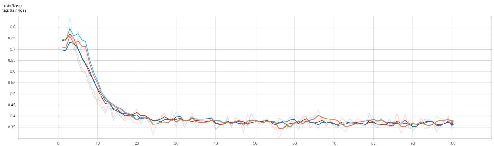
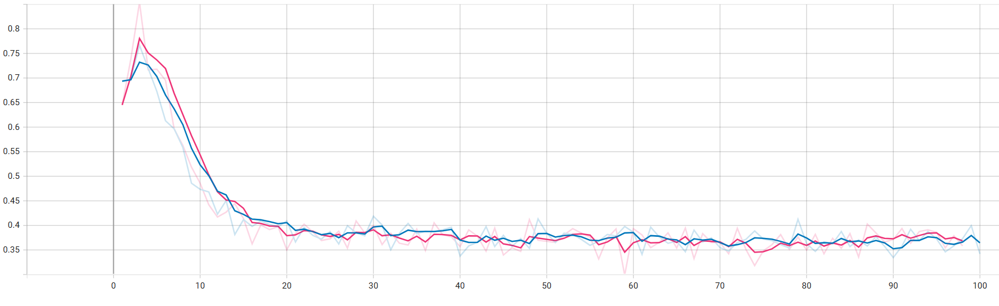
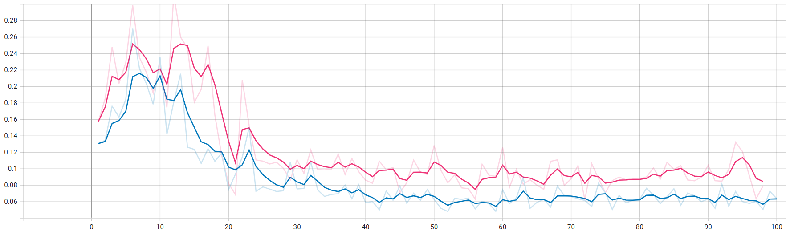
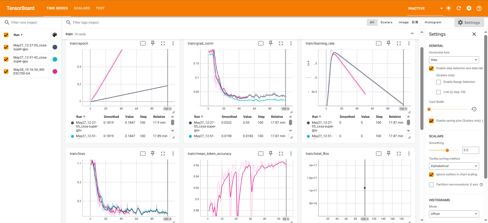

# Stock Price Prediction using Llama3 with unsloth

## 資料來源

### **相關公司金融領域新聞**

可以用 RAG 方式在 inference 階段放到 context 的部分提供 LLM 額外資訊，以下的 API 都是使用免費版，所以最多只能取得 至今道 30 天前的新聞，註冊取得個人 token 即可使用

- [`newsapi`](https://newsapi.org/) : 有支持中文新聞和篩選公司，但一天只有 100 筆資料
- [`yfinance`](https://github.com/ranaroussi/yfinance) : 每天也有限制可取得的次數，且沒有中文

所以選擇使用 [`newsapi`](https://newsapi.org/) 來取得相關新聞

### **協助判別工具**

- [`twstock`](https://github.com/mlouielu/twstock) : 提供簡單的買賣指標，可以提供模型輔助資訊來預測股票價格

### **公司選擇**

參考:   [中央通訊社 Central News Agency 黃仁勳演講背板合作火板](https://www.cna.com.tw/news/afe/202406030108.aspx)

選擇最與晶片相關的公司，參考與 NVIDIA 合作公司，以及一些金融股，並且整理出有上市且可透過 `twstock` 取得股票歷史價格以及相關新聞的公司如下 77 家公司

| 研揚 | 宏碁 | 凌華 | 安提國際 | 英研智能 | 巨大 | 雲達科技 |
| --- | --- | --- | --- | --- | --- | --- |
| 城智科技 | 安宏生醫 | 亞太智能機器 | 之初加速器 | 日月光 | 技嘉 | 廣達 |
| 華擎 | 華碩 | 艾微嵐奇 | 圓剛 | 艾訊 | 集雅科技 | 所羅門 |
| 比價王 | 勤誠 | 集仕多 | 七彩虹 | 仁寶 | 弘億股 | 矽品 |
| 索泰 | 中光電 | 滿拓科技 | 神瑞人工智慧 | 台達電 | 合宜家居 | 儒捷 |
| 適著三維科技 | 敦新科技 | 益登科技 | 慧友 | 鴻海 | 數位無限軟體 | 飛捷 |
| 鴻佰 | 映眾 | 英業達 | 迎廣 | 廣運 | 京元電 | 澄風科技 |
| 立端 | 麗臺 | 樂達科技 | 律果科技 | 光寶科 | 鑫薩林科 | 美超微 |
| 萬利達 | 聯發科 | 宇見智能科技 | 神達 | 微星 | 庫曜科技 | 達明機器人 |
| 新漢 | 醫揚 | 同德 | 和碩 | 德律 | 曜越 | 趨勢科技 |
| 台積電 | 聯電 | 欣興 | 超恩 | 緯創 | 緯穎 | 聰泰 |

## 資料前處理

1. 移除沒有上市的公司
    
    有些沒辦法用 `twstock` 的取得股票編號，或是根本沒有上市的公司也沒辦法進行股票投資，最後篩選出以下 41 公司
    
    | 研揚 | 宏碁 | 凌華 | 研華 | 日月光 | 華擎 | 華碩 |
    | --- | --- | --- | --- | --- | --- | --- |
    | 圓剛 | 艾訊 | 勤誠 | 仁寶 | 中光電 | 台達電 | 益登科技 |
    | 慧友 | 鴻海 | 巨大 | 技嘉 | 英業達 | 迎廣 | 廣運 |
    | 立端 | 麗臺 | 光寶科 | 聯發科 | 神達 | 微星 | 新漢 |
    | 和碩 | 廣達 | 所羅門 | 飛捷 | 德律 | 曜越 | 醫揚 |
    | 台積電 | 聯電 | 欣興 | 緯創 | 緯穎 | 聰泰 |  |
2. 取得相關新聞資訊
    
    使用 `newsapi` 取得有關公司的新聞資訊，並整理成 `.json` 檔，每一筆資料整理的格式如下，但並不是每個公司都有中文和英文的新聞資訊
    
    ```json
    {
    	"name_zh": "宏碁",
    	"name_en": "Acer",
    	"news_zh": [...], 
    	"news_en": [...],
    	"code": "2353"
    }
    ```
    
3. 使用 `twstock` 取得目標公司 2024/12 至今的所有股票價格資料，並記錄到 `.csv` 中
    
    ```python
    ,date,capacity,turnover,open,high,low,close,change,transaction
    0,2025-01-02,53594040,1940182343,37.45,37.55,35.5,35.5,-2.15,28766
    1,2025-01-03,13816873,500942875,36.25,36.5,36.05,36.2,0.7,5900
    2,2025-01-06,11107457,409334732,36.55,37.1,36.3,36.95,0.75,6129
    ...
    ```
    
4. Prompt Template
    - 自行設計: 每段對話都有 `content` 和 `role` ， `content` 表示對話內容， `role` 是對話腳色，分別為`user` 和 `assistant` ， `user` 是指輸入資料的那一方， `assistant` 的對話內容則是 LLM 預期輸出果，就像是使用者和 LLM 對話，透過不斷告訴 LLM 輸入問題和預期輸出來進行 fine-tuning
        - 過去幾天已知股票價格包含: 日期、開盤價、最高價、最低價、收盤價、數量等
        - 提示 LLM 預測後幾天的價格
        
        ```json
            [
                {
                    "content": "Here is past 1 day stock price of 巨大 company.\n\nDate: 2025-01-03, Open: 141.5, High: 143.5, Low: 138.0, Close: 139.0, Capacity: 1447003\nPredict the next date price:\n",
                    "role": "user"
                },
                {
                    "content": "The next 1 day price is: Date:\n 2025-01-06, Open: 139.5, High: 144.5, Low: 137.5, Close: 143.0, Capacity: 1208884\n",
                    "role": "assistant"
                }
            ],
        ```
        
    - 用以 Llama 來源的 tokenizer 函數 `apply_chat_template()` ，可以確保輸入格式和模型訓練格式是一樣的，例如會加上 special token 在字串中如下
        
        ```python
        '<|begin_of_text|><|start_header_id|>system<|end_header_id|>\n\nCutting Knowledge Date: December 2023\nToday Date: 26 July 2024\n\n<|eot_id|><|start_header_id|>user<|end_header_id|>\n\nHere is past 1 day stock price of 巨大 company.\n\nDate: 2025-01-09, Open: 145.0, High: 145.0, Low: 138.0, Close: 138.0, Capacity: 1697605\nPredict the next date price:\n<|eot_id|><|start_header_id|>assistant<|end_header_id|>\n\nThe next date price is: Date:\n 2025-01-10, Open: 138.5, High: 144.5, Low: 137.5, Close: 143.5, Capacity: 1740644\n<|eot_id|>'
        ```
        
5. 預測方式
    
    因為我要用前幾天的價格去預測後幾天的價格，最長是給三個月並預測整個月的股票資訊，以下會將所有資料混和整理到 `.json` 檔中，然後一起輸入到 LLM 中進行微調
    
    - 根據前 1 天預測下 1 天價格
    - 根據前 5 天預測後 5 天所有價格
    - 根據前一個月預測後 5 天所有價格
    - 根據前三個月預測後 1 個月所有價格

## Fine-tuning



### Model

| Model | 描述 |
| --- | --- |
| [**Llama-3.2-3B-Instruct**](https://huggingface.co/meta-llama/Llama-3.2-3B-Instruct) | Meta 推出開源模型的其中一個，具有 3.21 億個參數，支持多語言微調，且延續 Llama-2 是用 人類回饋的強化學習 (RLHF) 預訓練，在有限資源條件下，所以選擇此模型進行 監督微調 (SFT) 來預測不同區間的股票資訊 |
| [Llama-3-8b-bnb-4bit](https://huggingface.co/unsloth/llama-3-8b-bnb-4bit) | 這個是 `unsloth` 基於 Meta 開發的 Llama3 模型用 [4-bit 量化技術](https://huggingface.co/docs/bitsandbytes/reference/nn/linear4bit) ， 就是把浮點數轉為只用 4 個位元就可以存放的數值，降低儲存空間和訓練所需 VRAM，可以用較少的資源去微調大語言模型 |

### 減少運算資源的使用

1. 使用  [Unsloth](https://docs.unsloth.ai/) 套件來微調開源模型 [llama-3.2-3B-Instruct](https://huggingface.co/meta-llama/Llama-3.2-3B-Instruct)  
    1. 安裝套件
        
        ```
        %%capture
        !pip install unsloth
        # Also get the latest nightly Unsloth!
        !pip uninstall unsloth -y && pip install --upgrade --no-cache-dir --no-deps git+https://github.com/unslothai/unsloth.git@nightly git+https://github.com/unslothai/unsloth-zoo.git
        ```
        
    2. 可選擇的微調模型: 可到官網查看更多支持的模型，此次只使用  `unsloth/Meta-Llama-3.1-8B-bnb-4bit` 和  `unsloth/Llama-3.2-3B-Instruct`  
        
        ```python
        "unsloth/Meta-Llama-3.1-8B-bnb-4bit",      # Llama-3.1 2x faster
        "unsloth/Meta-Llama-3.1-8B-Instruct-bnb-4bit",
        "unsloth/Meta-Llama-3.1-70B-bnb-4bit",
        "unsloth/Meta-Llama-3.1-405B-bnb-4bit",    # 4bit for 405b!
        "unsloth/Mistral-Small-Instruct-2409",     # Mistral 22b 2x faster!
        "unsloth/mistral-7b-instruct-v0.3-bnb-4bit",
        "unsloth/Phi-3.5-mini-instruct",           # Phi-3.5 2x faster!
        "unsloth/Phi-3-medium-4k-instruct",
        "unsloth/gemma-2-9b-bnb-4bit",
        "unsloth/gemma-2-27b-bnb-4bit",            # Gemma 2x faster!
        "unsloth/Llama-3.2-1B-bnb-4bit",           # NEW! Llama 3.2 models
        "unsloth/Llama-3.2-1B-Instruct-bnb-4bit",
        "unsloth/Llama-3.2-3B-bnb-4bit",
        "unsloth/Llama-3.2-3B-Instruct-bnb-4bit",
        "unsloth/Llama-3.3-70B-Instruct-bnb-4bit" # NEW! Llama 3.3 70B!
        ```
        
    3. Llama 系列開源模型: 若是要從 hugging face 上取得模型，因為 Meta 要防止他們的開源模型商用以及從中不法獲利，需申請模型使用的 token 才可以使用模型
        1. 填寫申請表
            
            
            
        2. 最後顯示已取得這個模型，就可以使用剛剛的 token 在本地端用 hugging face 取得這個模型
            
            
            
    4. 載入預訓練模型
        
        可以設定參數 `load_in_4bit` 或是 `load_in_8bit` 來選擇量化的方案，如果將 `load_in_4bit` 設置為 `True` ，就表示會將這個模型權重量化成 4 個位元就能儲存的數值，雖然這樣將原本的浮點數轉為精度較小的值，但這樣卻可以降低很多運算成本，讓一般沒有太多運算資源的使用者可以進入微調 LLM 的訓練中， `load_in_8bit` 亦是
        
        ```python
        model, tokenizer = FastLanguageModel.from_pretrained(
            model_name = "unsloth/Meta-Llama-3.1-8B-bnb-4bit",
            max_seq_length = max_seq_length,
            dtype = dtype,
            load_in_4bit = True,
        )
        ```
        

### Parameter-Efficient Fine-Tuning (PEFT)

PEFT 方法可以透過微調少量模型參數而不是所有模型參數，使大型預訓練大語言模型能夠有效地適應各種下游應用，而且可以大大降低計算成本，PEFT 是一種統稱，他底下有一堆微調技術，以下是 2019 至 2023 年的技術演進，其中 LoRA 是一個廣為使用的 PEFT 方法，目前 hugging face 已經有可以直接使用 [PEFT 的套件](https://huggingface.co/docs/peft/index)，可以透過這些套件選擇使用任意技術來微調 LLM，而此次將使用上述的 `unsloth` 套件與 LoRA 技術來微調 Llama 模型



Xu, L., Xie, H., Qin, S.J., Tao, X., & Wang, F.L. (2023). Parameter-Efficient Fine-Tuning Methods for Pretrained Language Models: A Critical Review and Assessment. *ArXiv, abs/2312.12148*.

### Low Rank Adaptation (LoRA)

1. 參考由微軟所發表的論文: [LoRA: Low-Rank Adaptation of Large Language Models](https://arxiv.org/abs/2106.09685) 中的的方法，LoRA 是 PEFT  中的一種方法，可以不用訓練全部參數，只要訓練橘色部分 $A$ 和 $B$ 的部分就行，藍色的 $W$ 就是 不用訓練
    
    
    
    Hu, J.E., Shen, Y., Wallis, P., Allen-Zhu, Z., Li, Y., Wang, S., & 
    Chen, W. (2021). LoRA: Low-Rank Adaptation of Large Language Models. *ArXiv, abs/2106.09685*.
    
2. 數學解釋
    
    每一層的輸出 $h$ 會等於一開始輸入的 $W_0$ (也就是預訓練權重) 加上這一層算完的 $\Delta W$ 
    
    $$
    ⁍
    $$
    
    此時固定預訓練權重 $W_0$ 的部分，只算 $\Delta W$ ，並用 縮放因子 $\frac{\alpha}{r}$ 控制權種輸出，可以有類似學習率的效果
    
    - $\frac{\alpha}{r} = 1$ : 實際群眾是多少就是多少
    - $\frac{\alpha}{r}>1$ : 放大權重，加強 LoRA 訓練效果
    - $\frac{\alpha}{r}<1$ : 縮小權重，減弱 LoRA 訓練效果，可能是防止 overfitting
    
    $$
    W_{final} = W_0 + (\frac{\alpha}{r}) \cdot \Delta W
    $$
    
    所以我們只會訓練 $\Delta W$ 的部分，並不會整個 $W_{final}$ 都訓練，並且使用兩個 low-rank 的矩陣$B \in R^{d\times r}$  和 $A \in R^{r\times k}$   來運算  $\Delta W$ ，這裡的 $r$ 就是指矩陣的 rank
    
    $$
    \Delta W = BA
    $$
    
3. 實作 LoRA model
    
    以下是透過  `unsloth`  中的物件  `FastLanguageModel`  來實作 LoRA 模型，可以直接設定對應上圖的參數，其中
    
    - `r` :  就是矩陣的 rank，可以看成矩陣的大小
    - `target_module` : 要進行 LoRA 微調的模組，這邊就選擇計算 Attention 的三個元素 query `q` 、 Key `k` 、 Value `v` ，因為計算 Attention 過程 $QK$ 兩個矩陣相乘的計算量會很大，還有 Feedforward 層 `up/down` 、 `gate`
    - `lora_alpha` : 可以參考該論文，其中提及縮放 $\Delta W$ 時所用到的數值  $\frac{\alpha}{\gamma}$  中的 $\alpha$
    
    ```python
    model = FastLanguageModel.get_peft_model(
        model,
        r = 16, # Choose any number > 0 ! Suggested 8, 16, 32, 64, 128
        target_modules = ["q_proj", "k_proj", "v_proj", "o_proj",
                          "gate_proj", "up_proj", "down_proj",],
        lora_alpha = 16,
        lora_dropout = 0, # Supports any, but = 0 is optimized
        bias = "none",    # Supports any, but = "none" is optimized
        # "unsloth" uses 30% less VRAM, fits 2x larger batch sizes!
        use_gradient_checkpointing = "unsloth", # True or "unsloth" for very long context
        random_state = 3407,
        use_rslora = False,  # Unsloth support rank stabilized LoRA
        loftq_config = None, # And LoftQ
    )
    ```
    

### Supervised fine-tuning `SFTTrainer`

我的策略是利用無監督式學習預訓練的模型，進行下游的監督式微調，所以使用套件 `trl` 中的 [`SFTTrainer`](https://huggingface.co/docs/trl/sft_trainer) 來更效率進行微調，用剛剛準備的資料以及模型為參數去訓練

```python
trainer = SFTTrainer(
    model = model,
    tokenizer = tokenizer,
    train_dataset = hf_dataset,
    dataset_text_field = "text",
    max_seq_length = max_seq_length,
    data_collator = DataCollatorForSeq2Seq(tokenizer = tokenizer),
    dataset_num_proc = 2,
    packing = False, 
    args = TrainingArguments(
        per_device_train_batch_size = 4,
        gradient_accumulation_steps = 4,
        warmup_steps = 5,
        max_steps = 60,
        learning_rate = 2e-4,
        fp16 = not is_bfloat16_supported(),
        bf16 = is_bfloat16_supported(),
        logging_steps = 1,
        optim = "adamw_8bit",
        weight_decay = 0.01,
        lr_scheduler_type = "linear",
        seed = 3407,
        output_dir = "outputs",
        report_to = "tensorboard", 
    ),
)
```

更多的參數設定可以參考 [hugging face 的文件](https://huggingface.co/docs/trl/sft_trainer#trl.ModelConfig) ，如果有遇到 `TypeError: SFTTrainer.__init__() got an unexpected keyword argument 'dataset_text_field' #1264` 的問題可以參考 GitHub 這個 [討論](https://github.com/unslothai/unsloth/issues/1264)

### 訓練參數

| 參數 | 數值 |
| --- | --- |
| Num examples | 17325 |
| Epoch number | 1 |
| Step | 60 |
| *Batch size per device* | 8 |
| *Gradient accumulation steps* | 4 |
| Num GPUs used | 1 |
| Total batch size  | (8 x 4 x 1) = 32 |
| Trainable parameters | 41,943,040/8,000,000,000 (0.52% trained) |

## Model Performance and Analysis

### Training Results

1. 輸入不同欄位的股票資訊
    1. 顏色
        1. 🟧 橘色: `['date', 'capacity', 'turnover', 'open', 'high', 'low', 'close', 'change', 'transaction']` 
        2. 🟦 深藍色: `['date', 'turnover', 'open', 'high', 'low', 'close', 'transaction']`
        3. 🟥 紅色: `['date', 'open', 'high', 'low', 'close', 'transaction']` 
    2. 損失函數沒有明顯差異
        
        
        
    3. 梯度范數: 呈現梯度大小，也有正常收斂
        
        
        
2. 是否有 Context
    
    🟦 淺藍色折線為沒有 context 的損失函數，對比其他有 context 的 loss 表現沒有明顯差異
    
    
    
3. 不同學習率調整策略
    1. 統一用欄位 `['date', 'turnover', 'open', 'high', 'low', 'close', 'transaction']`
    2. 顏色
        1. 🟦 藍色   : 使用 cosine
        2. 🟥 粉紅色: 使用 linear
    3. loss function: 沒啥差別
        
        
        
    4. Gradient norm: **cosine** 的 gradient norm 稍低，代表訓練過程可能更穩定或更容易收斂。
        
        
        
    
4. 不同 LoRA 參數
    
    

### Inference Results


## Code Availability

### File

| Code | Detail |
| --- | --- |
| `main.py` | Main file to execute training and inference process. |
| `model.py`  | LSTM and Llama model are defined here |
| `stock_api.py` | function api to   http://140.116.86.242:8081/stock/api/v1    including buy, sell, and get information of user |
| `utils.py` | utility functions are defined here |
| `main.py`  | main control of deciding operation to stock. |
| `dataset.py` | Define class object for stock prices data and newspaper data. |
| `stock_predictor.py` | Stock decision process: data preprocessing → training → predict future prices |

### Arguments

1. Mode
    
    
    | Name | Detail |
    | --- | --- |
    | `--train`  | 1 → 訓練模式, 0 → 推論模式 |
2. Data
    
    
    | Name | Detail |
    | --- | --- |
    | `--data-dir` | 資料存放的路徑 |
    | `--company-list-file` | 要訓練股票資訊的目標公司的 `.json` 檔案 |
    | `--year` | 自動收集目標公司的股票需要的時間: 年 |
    | `--month` | 自動收集目標公司的股票需要的時間: 月 |
    | `--choose-stock` | 如果沒有自行準備目標公司檔案，系統可以隨機選取 `choose-stock` 檔上市股票 |
3. Load pretrained model
    
    
    | Name | Detail |
    | --- | --- |
    | `--model-name` | 目前有 `unsloth/Llama-3.2-3B-Instruct`  和 `unsloth/Meta-Llama-3.1-8B-bnb-4bit`  兩種模型可以使用 |
    | `--max-seq-length` | 限制生成序列的最長長度 |
    | `--load_in_4bit` | 模型以 4-bit 載入 |
    | `--load_in_8bit` | 模型以 8-bit 載入 |
    | `--model-dir` | 訓練完模型儲存的路徑 |
4. LoRA
    
    
    | Name | Detail |
    | --- | --- |
    | `--rank` | 以 LoRA 訓練中的 $r$ ，決定了 $A$ 和 $B$ 的大小 |
    | `--lora-alpha` | LoRA 訓練中的 $\alpha$  |
    | `--lora-dropout` | LoRA 的 dropout rate |
    | `--random-state` | 設置隨機種子，每次執行訓練或微調時，模型的行為與結果一致 |
5. Trainer
    
    
    | Name | Detail |
    | --- | --- |
    | `--batch-size` | 每次模型訓練時，一次處理多少筆資料 |
    | `--gradient-accumulation-steps` | 累積幾個 batch 的梯度再更新一次模型權重 |
    | `--num-epochs` | 訓練模型幾次，一個 epoch 就是模型看過一遍所有訓練資料的過程 |
    | `--max-steps` | 設定總共要進行多少步（steps）訓練 |
    | `--learning-rate` | 每次模型更新時，權重要調整多少，就是學習步伐的大小 |
    | `--logging-steps` | 每隔多少個 training step，要輸出一次訓練日誌 |
    | `--optim` | 使用哪一種 優化器（optimizer） 來訓練模型 |
    | `--weight-decay` | 權重衰減是一個正則化技術，用來防止模型 overfitting |
    | `--lr-scheduler-type` | 學習率如何隨訓練進行而調整的策略，決定學習率的變化曲線 |
    | `--output-dir` | 模型訓練輸出結果要儲存在哪個資料夾，可以用於 `tensorboard` 的呈現 |
    | `--report-to` | 訓練過程中要將訓練指標（如 loss、learning rate 等）回報到哪裡，如本次實驗是用 `tensorboard` |

### Get Started
安裝所需套件
```bash
pip install -r requirements.txt 
```
1. 自行準備資料
    1.  將想要訓練的公司名字或是股票編號放到 `.json` 檔案中
        
        ```json
        [
            {"name_zh": "台積電"},
            {"name_zh": "聯發科"},
            {"code": 3711}, 
            ...
        ]
        ```
        
    2. 訓練
        
        ```bash
        python main.py --train 1 --company-list-file <json 檔名>
        ```
        
2. 系統隨機挑選資料
    
    設置參數 `--choose-stock` ，系統會隨機挑選並收集四大買點和四大賣點的各  `num`  檔上市股票資料去進行訓練
    
    ```bash
    python main.py --train 1 --choose-stock <num>
    ```
    
3. 查看訓練表現
    - 安裝 `tensorboard`
        
        ```bash
        pip install tensorboard
        ```
        
    - Launch TensorBoard
        
        ```bash
        tensorboard --logdir=outputs/runs
        ```
        
    - 打開 http://localhost:6006/  即可即時觀察訓練過程
        
        
        

### Inference

1. 使用已經微調好的模型進行預測股票
    - 公司的股票編號 `code` : 可以到 [台灣證券交易所官網的查詢系統](https://isin.twse.com.tw/isin/single_i.jsp)  查詢股票編號，以字串模式輸入
    - 輸入過去天數，和想要預測股票的未來天數
    
    ```bash
    StockPredictor.inference(self, code='2330', past=5, future=5, context="")
    ```
    
2. 過去與未來趨勢曲線圖
    
    會將輸入過去天數和預測的未來天數的股票資訊畫成 k 線圖，
    

## Future Work

1. 與其他傳統深度學習 CNN, RNN 等模型做比較
2. 可以透過應用介面更容易操作

## Reference

- [**What's 4-bit quantization? How does it help Llama2**](https://www.kaggle.com/code/lorentzyeung/what-s-4-bit-quantization-how-does-it-help-llama2)
- [**Rank-Stabilized LoRA: Unlocking the Potential of LoRA Fine-Tuning**](https://huggingface.co/blog/damjan-k/rslora)
- [Llama-3.2 1B+3B Conversational + 2x faster finetuning](https://colab.research.google.com/drive/1T5-zKWM_5OD21QHwXHiV9ixTRR7k3iB9?usp=sharing)
- [臺灣證券交易所 OpenAPI](https://openapi.twse.com.tw/)